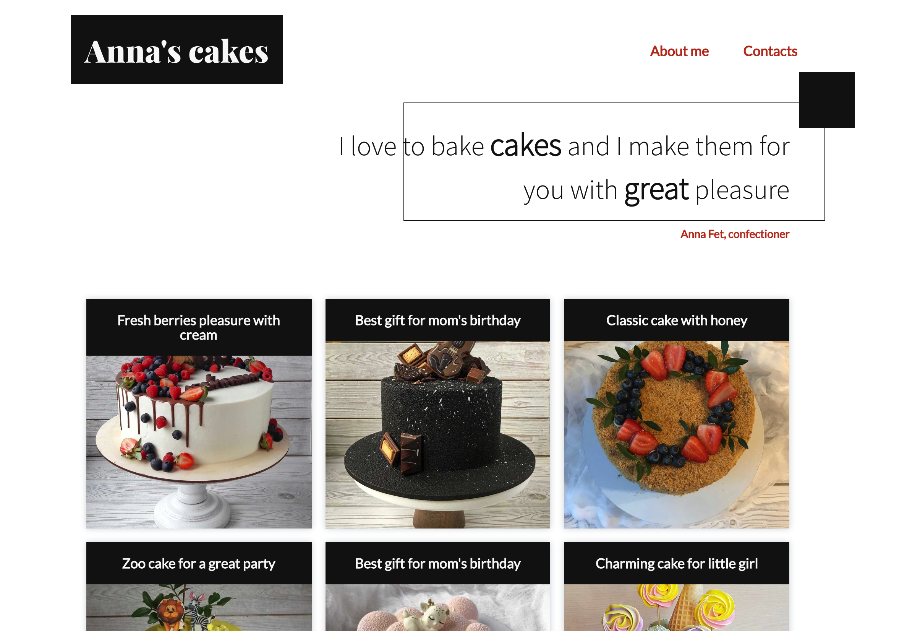

<h1 align="center">
  Gatsby's Blog Project
</h1>

## Simple Gatsby Blog

### 💫 Live version on Netlify

[Deploy to Netlify](https://dazzling-booth-931d45.netlify.app/)

This blog uses md pages to generate posts. This simple project is my first attemption to work with Gatsby. So I spent a couple of evenings to create it.

### Installation

1. git clone https://github.com/for-alisia/gatsby-ex.git
2. npm install
3. npm start

Everything as usual :)
